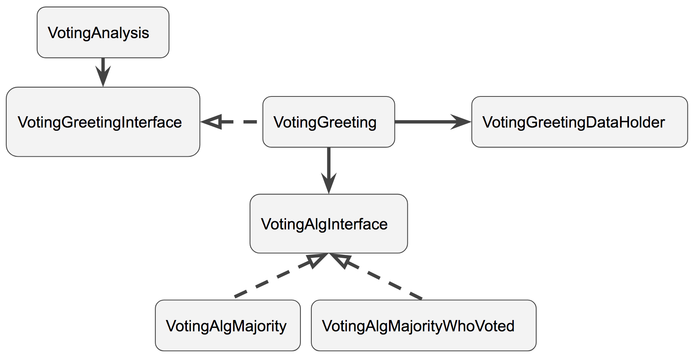

# Voting Greeting Example

These directories contain the Voting Greeting example. The example illustrates:

* Upgradable contract design.
* Keeping long term data in a delegate contract.
* Using a separate contract for analysis which aggregates multiple View calls into a 
single View call.  

## Use-Case
Like typical Greeting contracts, a greeting can be stored. Multiple participants
can be registered with the contract. Participants can propose items to be voted on, 
and then all participants can vote on the proposal. Items which can be voted on are:

* Add a participant
* Remove a participant.
* Change the voting algorithm.
* Change the vote viewing period. The vote viewing period is the time between the 
end of the voting period, and when the vote can be actioned.
* Setting a new implementation. This will effect an update of the contract. 
* Change the greeting.

## Architecture
The diagram below shows the architecture of the Voting Greeting example's Solidity code. 



`VotingGreetingInterface` is the main interface for the VotingGreeting. 

`VotingGreeting` implements `VotingGreetingInterface` and contains the logic for 
voting related transactions. It stores the the ephemeral state related to voting. 
All data is accessible via functions, as it is expected that this contract's API is 
not accessed directly, only via the interface.

`VotingAnalysis` contains View calls which aggregates multiple calls to 
`VotingGreeting`. The idea is that doing multiple View calls between an application
and an Ethereum node will incur a lot of latency. Doing a fewer calls should improve 
an application's performance.

`VotingAlgMajority` implements `VotingAlgorithmInterface`, and provides a voting 
algorithm in which the vote is deemed to have passed if the majority of participants
have voted *yes*. 

`VotingAlgMajorityWhoVoted` implements `VotingAlgorithmInterface`, and provides a voting 
algorithm in which the vote is deemed to have passed if the majority of participants
who voted have voted *yes*.


# Buiding and Testing
The contracts are written in Solidity. The code is tested utilising the Truffle 
framework.  For more information on installing and using Truffle, please 
refer to: http://truffleframework.com/docs/getting_started/installation . 
The tests that are currently included are writted in Javascript, which uses the 
Mocha framework (https://mochajs.org/) and 
Chai (http://www.chaijs.com/) for assertions.

## Truffle and Web3 Installation:
```
npm install -g truffle
```
The test code uses web3.js. To install web3.js:
```
npm install -g web3
```

## To run the tests:
1. Start the Truffle dev blockchain + console:
```
truffle develop
```

2. Compile the Solidity source:
```
compile
```

3. Ensure the latest contracts are deployed:
```
migrate --reset
```

4. Run the tests:
```
test
```

5. To exit:
```
.exit
```
